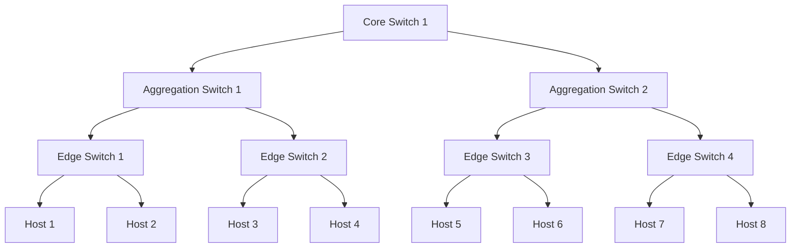

## Clos network

Clos network 是一個 multistage switch network，

<!-- 現在常用在 Data Center 內，clos network 創造了高同質性且相對公平的環境 -->

clos network 的優勢是可以將多個輸入與輸出透過小型的 switch ( 像只有 8 port ) 連接在一起

## fat tree

通常情况下，汇聚交换机是 L2 和 L3 网络的分界点，汇聚交换机以下的是 L2 网络，以上是 L3 网络。每组汇聚交换机管理一个 POD（Point Of Delivery），每个 POD 内都是独立的 VLAN 网络。服务器在 POD 内移动不必修改 IP 地址和默认网关，因为一个 POD 对应一个 L2 广播域。

## Spine-Leaf
